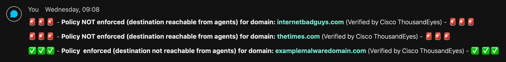

# Cisco ThousandEyes response workflow for SecureX
This SecureX response workflow allows users to right click on `domain` and `url` observable from Cisco SecureX threat response and check whether they are reachable from ThousandEyes endpoint agents. This is important for multiple reasons. First of all, an analyst can check whether a potential harmfull destination is reachable, and thus can cause a threat (e.g. a Command&Control server). Second it can also be used to verify the policy enforcement across your organization. Cisco ThousandEyes can for example be used to verify a domain block in Cisco Umbrella, offering a good SASE use case. Obviously there are more use cases that this is usefull for. 

## Features
* Searches for group_id of agents to start instant test from;
* Creates HTTP instant endpoint test for agents (with earlier queried group_id) to verify of domain is reachable;
* If domain/URL is reachable it will send a Webex Teams notifaction to warn that policy is not enforced;
* Vice versa, if domain/URL is not reachable, it will send a confirmation via Webex Teams that policy is enforced.

> **Note:** Please test this properly before implementing in a production environment. This is a sample workflow!

## Required Targets
- Webex Teams
- ThousandEyes (api.thousandeyes.com)

## Required Account Keys
- Webex Teams Token (stored as Secure String in workflow variables)
- ThousandEyes (Basic Auth: username and secret, associated with target)

## Required Global Variables
- ThousandEyes_group_id

## Required Atomic Workflows
- Webex Teams - Post Message to Room

## Setup instructions

1. Browse to your SecureX orchestration instance. This wille be a different URL depending on the region your account is in: 

* US: https://securex-ao.us.security.cisco.com/orch-ui/workflows/
* EU: https://securex-ao.eu.security.cisco.com/orch-ui/workflows/
* APJC: https://securex-ao.apjc.security.cisco.com/orch-ui/workflows/

### Import main workflow

1. In the left pane menu, select **Workflows**. Click on **IMPORT** to import the workflow.

2. Click on **Browse** and copy paste the content of the [workflow.json](https://raw.githubusercontent.com/chrivand/thousand-eyes-securex-response/master/workflow.json) file inside of the text window.  Select **IMPORT AS A NEW WORKFLOW (CLONE)** and click on **IMPORT**.

3. After importing, please make sure that you update the account keys for the **ThousandEyes** target. 

4. Also, please fill in the **Webex Token** as workflow variable. The best option for this is a [Webex bot](https://developer.webex.com/docs/bots), since the token will then not expire. 

> **Note:** If you prefer to use a different chat app, please change the last activities of the workflow to your liking.

5. You will also need a **groupId** of the set of ThousandEyes agents you want to run the test from. There is a skipped group in the workflow that you can use to find this ID, and then set it as global variable. Enter the group name as workflow variable and unskip this to find the ID. After running once you can skip the group again.

6. If you know the ID already you can also directly set it as global variable:

## Usage

You may use the response action via the drop down menu in SecureX threat response like so:

This will result in the following type of notifactions in Webex Teams:

## Notes

* Please test this properly before implementing in a production environment. This is a sample workflow!
* In a future version enterprise agents will be added. 

## Author(s)

* Christopher van der Made (Cisco)
* Primoz Secnik Kolman (Cisco)
