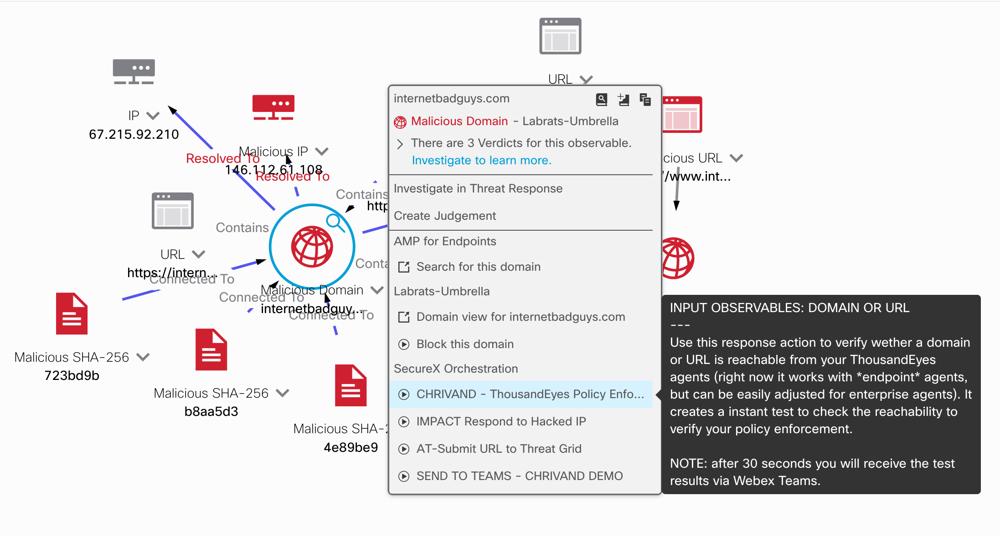
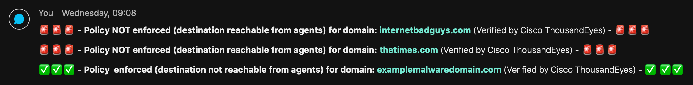

# SecureX orchestration workflow repository

* SecureX orchestration provides a no-to-low code approach for building automated workflows. 
* These workflows can interact with various types of resources and systems, whether they’re from Cisco or a third-party. 
* This repository contains a workflow that can be imported into SecureX orchestration.
* 
## Business Case

This SecureX response workflow allows users to right click on domain and url observable from Cisco SecureX threat response and check whether they are reachable from [Cisco ThousandEyes](https://www.thousandeyes.com/) endpoint agents. This is important for multiple reasons. First of all, an analyst can check whether a potential harmfull destination is reachable, and thus can cause a threat (e.g. a Command&Control server). Second it can also be used to verify the policy enforcement across your organization. Cisco ThousandEyes can for example be used to verify a domain block in Cisco Umbrella, offering a good SASE use case. Obviously there are more use cases that this is usefull for.

## Usage

You may use the response action via the drop down menu in SecureX threat response like so:

This will result in the following type of notifactions in Webex Teams:

## Related Sandbox
Currently there is no DevNet sandbox yet, however you can find all options to try out SecureX orchestration [here](https://developer.cisco.com/learning/lab/Cisco-SecureX-101-lab/step/1)!

## List of SecureX Learning Labs
* Please try out [this SecureX DevNet learning lab](https://developer.cisco.com/learning/modules/SecureX-orchestration) to try this yourself. 
* Please also check out the [SecureX microsite](https://developer.cisco.com/securex/) on DevNet!

## Solutions on Ecosystem Exchange
Please check out related solutions on [DevNet Ecosystem Exchange](https://developer.cisco.com/ecosystem/solutions/#key=securex).
